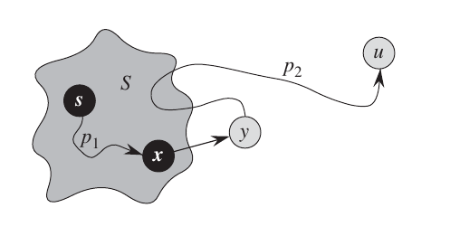

### 1. 最短路性质

给定图 $G=(V,E)$，$\delta(u,v)$ 表示最短路长 (不存在则为 $\infty$)，$w(p)$ 表示路径权重和。对任意结点 $d$:

-   $v.d$ 表示 $s$ 到 $v$ 的最短路估计，
-   $v.\pi$ 表示 $v$ 的前驱，该值诱导一个前驱子图 $G_\pi$，该图是 $s$ 的最短路径树

<font class="ps%">

```c linenums="1"
Init-Single-Source(G, s)
    v.d = ∞
    v.π = Null
s.d = 0
```

</font>

#### (1). 最优子结构

> <ktb></ktb>
> (最优子结构) 设 $p=\langle v_0, v_1,...,v_k \rangle$ 是从 $v_0$ 到 $v_k$ 的一条最短路，$p_{ij}=\langle v_i,v_{i+1},...,v_j\rangle$ 是 $p$ 的一条子路径，那么 $p_{ij}$ 是从 $v_i$ 到 $v_j$ 的一条最短路<br>

#### (2). 松弛操作及其性质

松弛的操作对象为边 $(u,v)$ 和目标点 $v$

<font class="ps%">

```c linenums="1"
Relax(u, v, w)
    if v.d > u.d + w(u, v)
        v.d = u.d + w(u, v)
        v.π = u
```

</font>

<!-- prettier-ignore-start -->

> <ktb></ktb>
> (收敛性质) 若 $s\leadsto u \to v$ 是 $G$ 中的一条最短路，且松弛 $(u,v)$ 前有 $u.d=\delta(s,u)$，则之后的所有时间有 $v.d=\delta(s,v)$<br>

<!-- prettier-ignore-end -->

> <ktb></ktb>
> (路径松弛性质) 设 $s=v_0$, $p=\langle v_0, v_1,...,v_k \rangle$ 是 $G$ 的一条最短路，$p$ 中的边松弛的相对次序为 $(v_0,v_1)$,$(v_1,v_2)$,$...$,$(v_{k-1},v_k)$，则 $v_k.d=\delta(s,v_k)$<br>

<!-- prettier-ignore-start -->

> <ktb></ktb>
> (上界性质) &ensp; $\forall v \in V,\ v.d\geq \delta(s,v)$. 一旦 $v.d$ 的取值达到 $\delta(s,v)$，其值无法通过松弛改变<br>

<!-- prettier-ignore-end -->

<!-- prettier-ignore-start -->

> <ktb></ktb>
> (三角不等式) &ensp; $\forall (u,v) \in E,\ \delta(s,v) \leq \delta(s,u) + w(u,v)$<br>

<!-- prettier-ignore-end -->

### 2. Bellman-Ford 算法

<font class="ps%">

```c linenums="1"
Bellman-Ford(G, s, w)
    Init-Single-Source(G, s)
    for i=1 to |G.V|-1:
        for each edge(u, v) ∈ G.E
            Relax(u, v, w)
    for each edge(u, v) ∈ G.E
        if v.d > u.d + w(u, v)
            return False
    return True
```

</font>

思路:

-   3-5 行对边的集合执行 $|V|-1$ 次松弛，保证每条最短路都可以被松弛出来；
-   如果存在负环路，直观上来看，负环上肯定存在某条边仍然可以被松弛

<!-- prettier-ignore-start -->

> <ktb></ktb>
> 假设 $G$ 包含可由 $s$ 到达的负环，则 6-8 行一定可以检测到<br>
> > 假设该负环为 $c=\langle v_0, v_1, ... ,v_k \rangle$，其中 $v_0=v_k$，那么 $\displaystyle \sum _ {i=1}^k w(v_{i-1}, v_i) < 0$ <br>
> > 现假设环上每条边都不能再松弛了，即 $v_i.d \leq v_{i-1}.d + w(v_{i-1}, v_i)$，相加可得: <br>
> > $$ \sum _ {i=1}^k v_i.d \leq \sum _ {i=1}^k (v_{i-1}.d + w(v_{i-1}, v_i)) = \sum _ {i=1}^k v_{i}.d + \sum _ {i=1}^k w(v_{i-1}, v_i) $$ 
> > 与假设矛盾。

<!-- prettier-ignore-end -->

复杂度 $O(VE)$

### 3. Dijkstra 算法

<font class="ps%">

```c linenums="1"
Dijkstra(G, s, w)
    Init-Single-Source(G, s)
    C = ∅    // close set
    O = G.V   // open set
    while O != ∅
        u = Extract-Min(O)
        C = C ∪ {u}
        for each vertex v ∈ G.Adj[u]
            Relax(u, v, w)
```

</font>

Dijkstra 算法总是在 $\mathit{Open - Close}$ 中做出贪心选择，选取最近的点加入 $O$ 中。

<!-- prettier-ignore-start -->

> <ktb></ktb>
> (Dijkstra 正确性) 当结点 $u$ 即将被加入 $C$ 时，有 $u.d = \delta(s,u)$<br>
> > 假设 $u$ 是第一个使得该结论不成立的结点 ($u\ne s$ 且 $C\ne\emptyset$)，假设 $w(p)=\delta(s,u)$，假设 $y$ 是 $s$ 到 $u$ 的路上第一个在集合 $V-C$ 中的结点，$x$ 是 $y$ 的前驱，这样就将 $p$ 分解为 $s \overset{p_1}{\leadsto} x \to y \overset{p_2}{\leadsto} u$<br>
> >  <br>
> > ($p_1$ 或 $p_2$ 可能不包含任何边) <br>
> > 由于 $x$ 已在 $C$ 中，必有 $y.d = \delta(s,y)$，又因为所有边非负，有 $y.d = \delta(s,y) \leq \delta(s,u) \leq u.d$; 由于 $u$ 即将被加入 $C$，有 $u.d \leq y.d$，有 $y.d = \delta(s,u) = u.d$ 成立，与假设矛盾 <br>
> > 这也说明如果有负权边存在，可能导致 $y.d=\delta(s,y) > u.d > \delta(s,u)$，例如
> > 

<!-- prettier-ignore-end -->

该算法的复杂度主要来自于 `Extract-Min` 和 更新 $O$ 中的权值两部分

-   朴素实现: $O(V\cdot V + E) = O(V^2)$
-   最小堆实现: $O(V\cdot \lg V + E\cdot\lg V)$。如果 $G$ 是稀疏图，该方案相对 $O(V^2)$ 会有改善
