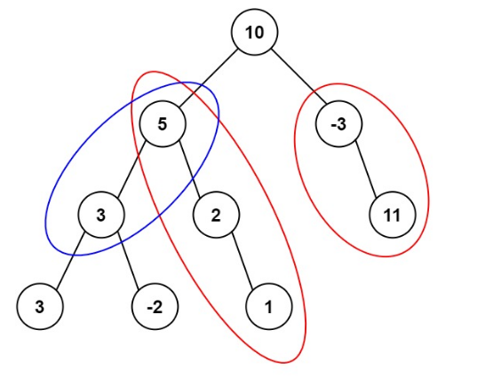

<!-- prettier-ignore-start -->

> 给定一个二叉树的根节点 root ，和一个整数 targetSum ，求该二叉树里节点值之和等于 targetSum 的 路径 的数目 <br>
> 路径不需要从根结点开始，也不需要在叶节点结束，但必须是向下的 (从父结点到子结点)。
> Example:
```
输入：root = [10,5,-3,3,2,null,11,3,-2,null,1], targetSum = 8
输出：3
解释：和等于 8 的路径有 3 条，如图所示
```
> &emsp;<br>
Note:
>
-   树中节点总数在范围 `[0, 1000]` 内
-   `-1000 <= targetSum <= 1000`
-   `-10^9 <= Node.val <= 10^9`

<!-- prettier-ignore-end -->

<br>

树的遍历 + 前缀和计算:

-   先序时机可得前缀和，并计算以该结点结尾的目标和路径树
-   后序时机更新前缀和和路径信息

??? adcodes "solution"

    ```cpp
    class Solution {
    public:
        int pathSum(TreeNode* root, int target_sum) {
            traverse(root, target_sum);
            return path_sum;
        }

    private:
        void traverse(TreeNode* root, int target_sum) {
            if (!root)
                return;
            cur_prefix_sum += root->val;
            auto dst_iter = prefix_sum_map.find(cur_prefix_sum - target_sum);
            if (dst_iter != prefix_sum_map.end())
                path_sum += dst_iter->second;
            prefix_sum_map[cur_prefix_sum]++;
            traverse(root->left, target_sum);
            traverse(root->right, target_sum);
            prefix_sum_map[cur_prefix_sum]--;
            cur_prefix_sum -= root->val;
        }

        unordered_map<int, int> prefix_sum_map{{0, 1}, };
        int cur_prefix_sum = 0;
        int path_sum = 0;
    };
    ```
