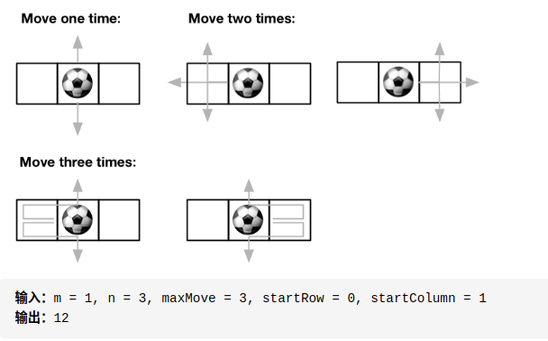

<!-- prettier-ignore-start -->

> 给定大小为 `mxn` 的网格和球的起始坐标 `[startRow, startColumn]`，最多可以移动 `maxMove` 次球，求可以将球移出边界的路径数。(返回对 `10^9 + 7` 取余后的结果)<br>
&emsp;&emsp; <br>
Note:
>
- `1 <= m, n <= 50`
- `0 <= maxMove <= 50`
>
> (Medium)

<!-- prettier-ignore-end -->

<br>

思路比较容易想到:

-   `dp[i][j][k]` 表示从 `grid[startRow][startColumn]` 到 `grid[i][j]` 长为 `k` 的路径数
-   `dp[i][j][k] = dp[i-1][j][k-1] + dp[i+1][j][k-1] + dp[i][j-1][k-1] + dp[i][j+1][k]`
-   init: &ensp; `dp[startRow][startColumn][0] = 1`, `dp[..][..][0] = 0`

不要 fanchun:

-   在四周加格子不行，会多出不存在的路径
-   统计结果时数边而不是数格子
-   `loop [1, maxMove - 1] : { cal dp; add res; }`，很明显 0 作为特殊情况
-   该在何处 `% MOD`

??? adcodes "solution"

    ```cpp
    class Solution {
    public:
        using LL = long long;

        int findPaths(int m, int n, int max_move, int start_row, int start_column) {
            if (max_move == 0)
                return 0;
            vector<vector<LL>> dp_curr(m, vector<LL>(n));
            vector<vector<LL>> dp_last(m, vector<LL>(n));
            dp_last[start_row][start_column] = 1;
            long res = calPathSum(dp_last);

            for (int mv = 1; mv < max_move; ++mv) {
                for (int i = 0; i < m; ++i) {
                    for (int j = 0; j < n; ++j) {
                        dp_curr[i][j] = 0;
                        for (int *dir : DIRECTIONS) {
                            int ni = i + dir[0], nj = j + dir[1];
                            if (inArea(ni, nj, dp_curr)) {
                                dp_curr[i][j] += dp_last[ni][nj] % (1000000000 + 7);
                            }
                        }
                    }
                }
                res += calPathSum(dp_curr);
                swap(dp_curr, dp_last);
            }

            return res % (1000000000 + 7);
        }

    private:
        long calPathSum(vector<vector<LL>>& dp) {
            long res = 0, m = dp.size(), n = dp[0].size();
            for (int j = 0; j < n; ++j) {
                res += (dp[0][j] + dp[m - 1][j]) % (1000000000 + 7);
            }
            for (int i = 0; i < m; ++i) {
                res += (dp[i][0] + dp[i][n - 1]) % (1000000000 + 7);
            }
            return res;
        }

        int inArea(int x, int y, vector<vector<LL>>& dp) {
            return x >= 0 && x < dp.size() && y >= 0 && y < dp[0].size();
        }

        int DIRECTIONS[4][2] = {{0, 1}, {0, -1}, {1, 0}, {-1, 0}};
    };
    ```

时间 $O(m\times n\times \mathit{max\\_move})$，空间 $O(mn)$
